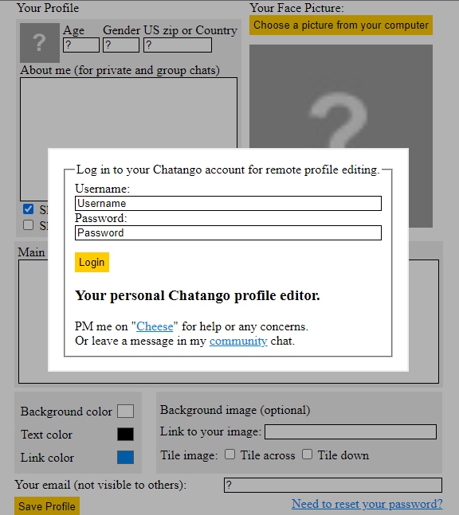
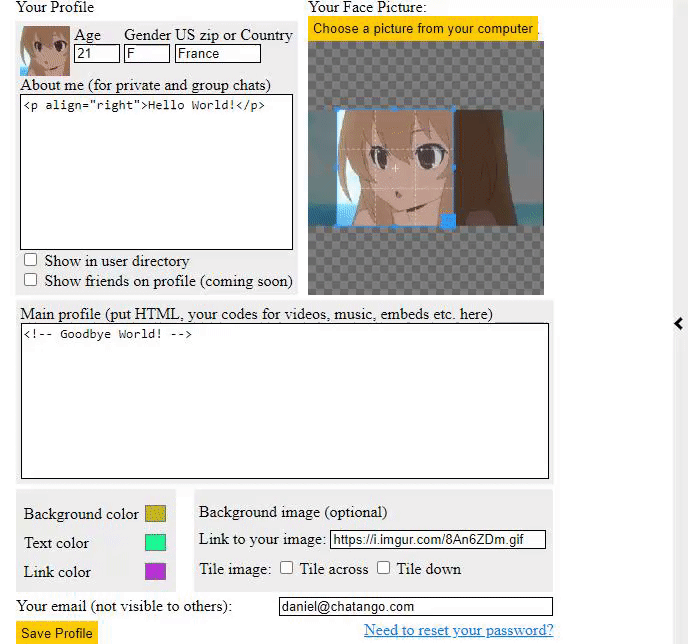
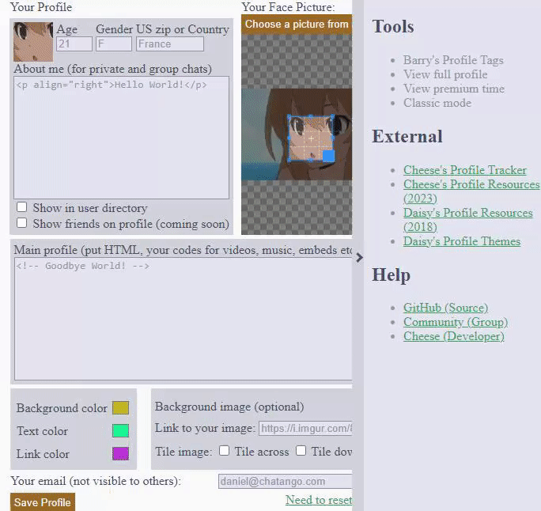

# Chatango Flash Profile Editor in HTML5
Update your full and mini Chatango profile remotely and locally.

# Features
- Themes
- Image cropping
- Mini profile editing
- Full profile editing
- Background time viewer
- Barry's Profile Tags Parser
- External resources and tools for your profile
- A sense of nostalgia

# Requirements and dependencies
- Python ^3.10.x
- lxml ^4.9.2
- flask ^2.3.3
- requests ^2.20.0

```bash
pip install lxml
pip install flask
pip install requests
```

# Preview







# Step by step

1. Install [Python](https://www.python.org/) version 3.10+ and make sure `Add Python to PATH` and `pip` are checked
2. Open command prompt and type `pip install lxml flask requests`, if `pip is not recognized` check the above step by opening the Python installer and modifying the installation, or restart your device.
3. Run or double click `updateprofile.py` once all external dependencies have installed, if it closes immediately open it in Python IDE and run again to see errors.
4. If you see something along the lines of `running on`, go to [http://localhost:8080/updateprofile](http://localhost:8080/updateprofile) or the host that it shows.
5. Log in when prompted, and now you have your own personal "Flash" Chatango profile editor!

If you can't get it working or are having other concerns, feel free to message me on "[Cheese](https://cheese.chatango.com)" or leave a message in my [community](https://community.chatango.com) chat.
If this is too much or you can't be bothered, you may use the [online version](https://vissle.me/profile/edit) instead.

# Some questions

- Is this safe to use?
> Yes, you are running it [locally on your machine](https://security.stackexchange.com/questions/17685/should-i-use-ssl-for-local-access).

- Why is my full profile not showing up?
> You need my [profile tracker](https://vissle.me/track) with the "Show my full profile" option enabled, the script needs to be placed in your mini profile.

# Disclaimer

Neither Barry nor Daisy had any say in this project and were not told anything about it, their inclusion is out of respect and preservation of their work.
Do not contact or harass them about it.
